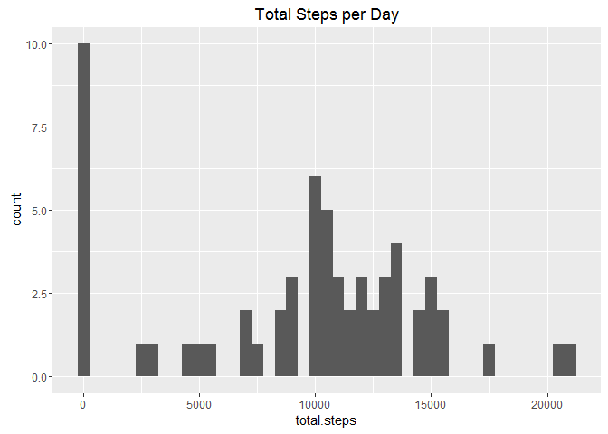
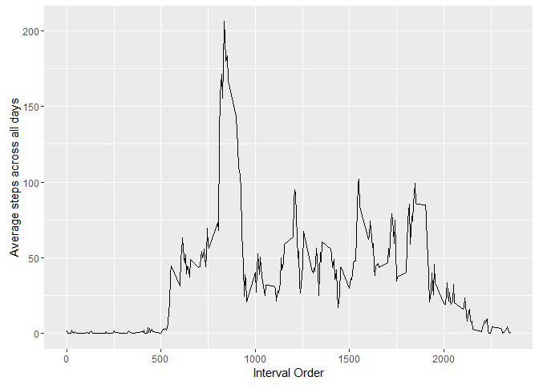
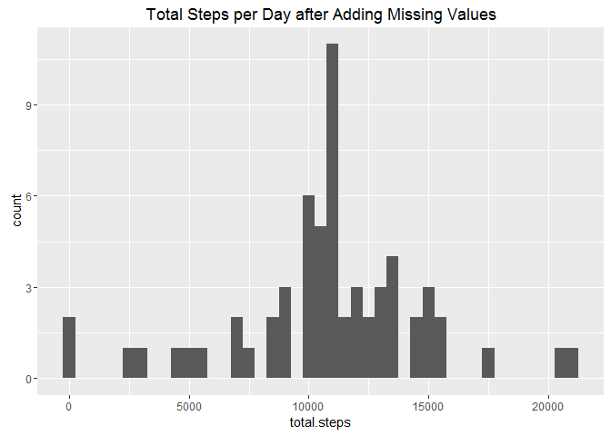
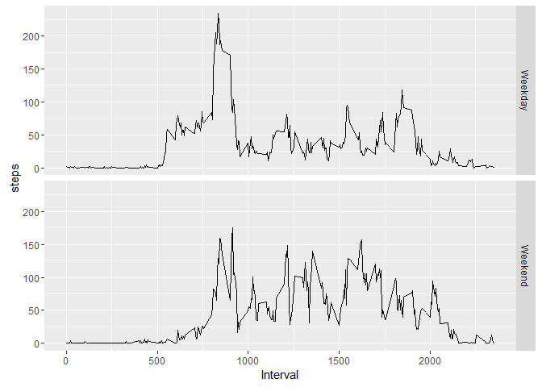

Loading and preprocessing the data
----------------------------------

First step: load "activity.csv" file from R working directory and assign
it to a data frame named "activity". It has three columns:  
*- steps: Number of steps taking in a 5-minute interval  
- date: The date on which the measurement was taken in YYYY-MM-DD
format  
- interval: Identifier for the 5-minute interval in which measurement
was taken*

    activity<-read.csv("D:/Data Scientist/R_working_directory/activity.csv",na.strings="NA")
    head(activity)

    ##   steps       date interval
    ## 1    NA 2012-10-01        0
    ## 2    NA 2012-10-01        5
    ## 3    NA 2012-10-01       10
    ## 4    NA 2012-10-01       15
    ## 5    NA 2012-10-01       20
    ## 6    NA 2012-10-01       25

Convert "date" column to Date class by "as.Date" function.

    activity$date<-as.Date(activity$date,"%Y-%m-%d")

What is mean total number of steps taken per day?
-------------------------------------------------

Calculate total number of steps per day.

    AC_by_day<-aggregate(activity$steps,by=list(activity$date),FUN="sum",na.rm=TRUE)
    names(AC_by_day)<-c("date","total.steps")

Here is the histogram of the total number of steps per day.

    library(ggplot2)
    g<-qplot(total.steps,data=AC_by_day,binwidth=500)
    g+labs(title="Total Steps per Day")

    #dev.copy(png,"plot1.png")
    #dev.off()

Mean of total daily steps is:

    StpMean<-mean(AC_by_day$total.steps,na.rm=TRUE)
    StpMean

    ## [1] 9354.23

Median of total daily steps is:

    StpMedian<-median(AC_by_day$total.steps,na.rm=TRUE)
    StpMedian

    ## [1] 10395

What is the average daily activity pattern?
-------------------------------------------

Calculate average steps at each 5 mins interval order across all days.
Plot the average steps vs interval order.

    AC_by_Int<-aggregate(activity$steps,by=list(activity$interval),FUN="mean",na.rm=TRUE)
    names(AC_by_Int)<-c("Interval","steps")

    qplot(AC_by_Int$Interval,AC_by_Int$steps,
             geom=c("line"),
             xlab="Interval Order",ylab="Average steps across all days"
          )

    #dev.copy(png,"plot2.png")
    #dev.off()

The maximum steps in 5-min interval is:

    IntStepMax<-AC_by_Int[which.max(AC_by_Int$steps),1]
    IntStepMax

    ## [1] 835

Imputing missing values
-----------------------

Original dataset contains many missing data points. Total number of NA
rows is:

    sum(is.na(activity$steps))

    ## [1] 2304

Now let's add missing values by using the mean for that 5-min interval
and save it to a new data frame named "acivity2".

    ind_NA<-which(is.na(activity$steps)==TRUE)
    activity2<-activity

    for (i in ind_NA) {
          activity2$steps[i]<-AC_by_Int$steps[AC_by_Int$Interval==activity2$interval[i]]
    }

Check the missing values in "activity2".

    sum(is.na(activity2))

    ## [1] 0

Plot the histogram of the total number of steps per day. the new data
frame "activity2" after adding missing values.

    AC_by_day2<-aggregate(activity2$steps,by=list(activity2$date),FUN="sum",na.rm=TRUE)
    names(AC_by_day2)<-c("date","total.steps")

    g<-qplot(total.steps,data=AC_by_day2,binwidth=500)
    g+labs(title="Total Steps per Day after Adding Missing Values")

    #dev.copy(png,"plot3.png")
    #dev.off()

Compare it with the distogram from original data. Before adding missing
values, the distogram of original data has a lot of actificial zero
points due to missing values. The mean and median value of total daily
steps calculated from original dataset are also misleading due to this
issue.

Mean of total daily steps after adding missing values.

    StpMean2<-mean(AC_by_day2$total.steps,na.rm=TRUE)
    StpMean2

    ## [1] 10766.19

Median of total daily steps after adding missing values.

    StpMedian2<-median(AC_by_day2$total.steps,na.rm=TRUE)
    StpMedian2

    ## [1] 10766.19

Are there differences in activity patterns between weekdays and weekends?
-------------------------------------------------------------------------

First add weekday and weekend information to "activity2" data frame.
Then calculate the average steps at each 5-min interval for each
category.

    tmp<-weekdays(activity2$date)
    tmp2<-sapply(tmp,function(x) {
                  if (x=="Saturday"|x=="Sunday") "Weekend"
                  else   "Weekday"
    })

    activity2<-cbind(activity,tmp,tmp2)
    names(activity2)[4:5]<-c("Weekday.name","Weekday")

    AC_by_Int2<-aggregate(activity2$steps,by=list(activity2$Weekday,activity$interval),FUN="mean",na.rm=TRUE)
    names(AC_by_Int2)<-c("Weekday","Interval","steps")
    AC_by_Int2$Weekday<-as.factor(AC_by_Int2$Weekday)

Plot the activity pattern for both weekdays and weekends.

    g<-ggplot(AC_by_Int2,aes(Interval,steps))
    g+geom_line()+facet_grid(Weekday~.)

    #dev.copy(png,"plot4.png")
    #dev.off()
